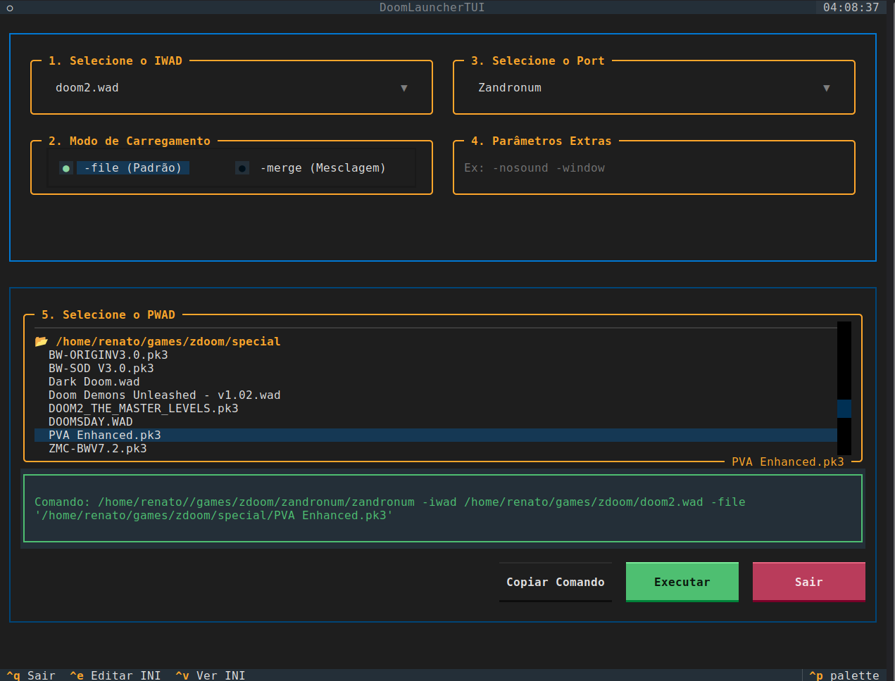

[English](README.md) | [Português](README.pt.md) | [Español](README.es.md)

# DoomTUI

**DoomTUI** es un lanzador moderno y elegante basado en terminal (TUI), desarrollado en Python utilizando el framework [Textual](https://github.com/Textualize/textual). Fue creado para gestionar e iniciar fácilmente tus juegos favoritos basados en el motor Doom, organizando IWADs, PWADs (carpetas y archivos `.wad` o `.pk3`) y múltiples Source Ports de forma limpia e intuitiva.



## 🚀 Funcionalidades

* **Interfaz TUI Moderna:** Construida con Textual, ofreciendo navegación por teclado y una apariencia limpia.
* **Detección Automática:** Escaneo de directorios configurados para encontrar IWADs y PWADs.
* **Soporte para Múltiples Formatos:** Compatible con archivos `.wad` y `.pk3`.
* **Modos de Carga:** Alternancia rápida entre `-file` (predeterminado) y `-merge` (fusión).
* **Editor de Configuración Integrado:** Visualiza o edita el archivo de configuración `.ini` directamente desde la aplicación a través de una pantalla modal con un editor de texto integrado.
* **Vista previa de Comandos:** Sigue el comando completo generado en tiempo real, con soporte para copia rápida al portapapeles (`xclip` / `wl-clipboard`).

## 🛠️ Requisitos

* Python 3.9+
* [pipx](https://pipx.pypa.io/)
* Opcional: `xclip` o `wl-clipboard` (copiar el comando al portapapeles)

La biblioteca `textual` se instala automáticamente.

## 📦 Instalación

1. Instala [pipx](https://pipx.pypa.io/stable/installation/) (Debian / Ubuntu / Linux Mint):

```bash
   sudo apt install pipx
   pipx ensurepath
```

   Luego, reinicia tu terminal.

2. Instala DoomTUI:

```bash
   pipx install git+https://github.com/rlins10/doomtui.git
```

   Para actualizar después:

```bash
   pipx upgrade doomtui
```

## ⚙️ Configuración

3. DoomTUI crea automáticamente el archivo de configuración en la primera ejecución en:
    
    ```bash
    ~/.config/doomtui/doomtui.ini
    ```
    * La aplicación no lee el archivo `doomtui.ini.example` del repositorio, es solo un ejemplo.
    
4. Ejemplo de la estructura predeterminada del **.ini:**

    ```ini
    [IWADSearch.Directories]
    Path=$DOOMWADDIR
    Path=$HOME/games/others

    [PWAD.Directories]
    Path=$HOME/games/doom/doom-pwad
    Path=$HOME/games/doom/doom2-pwad

    [PORT.Directories]
    Port=gzdoom
    Port=uzdoom
    Port=$HOME/games/zandronum/zandronum
    ```
    
## 🎮 Cómo Usar

5. Ejecuta el script principal desde la terminal:

   ```bash
   doomtui
   ```
   * Usa el editor para configurar los directorios de tus ports, iwads y pwads
   * Guarda tu archivo .ini
   * Selecciona tus opciones
   * Juega a gusto

6. Atajos de Teclado Principales:
   * ctrl-e: Abre el editor modal para modificar el archivo doomtui.ini.
   * ctrl-v: Abre el modo de solo lectura del archivo doomtui.ini.
   * ctrl-q: Sale de la aplicación.
   * Esc: Sale del editor y/o visor.

## 🗺️ (TODO)

7. Próximos Pasos
   * [ ] Actualización automática (Auto Refresh) de las selecciones de iwad.
   * [ ] Guardar los parámetros adicionales en el .ini.
   * [ ] Añadir comprobación automática de actualizaciones del proyecto.
   * [ ] Soporte multiidioma.
   * [ ] Probar en Windows.

## 📄 Licencia

   * Este proyecto se distribuye bajo los términos de la licencia GNU General Public License v2.0 (GPLv2). 
   * Consulta el archivo LICENSE para más detalles.
   * Copias permitidas.
